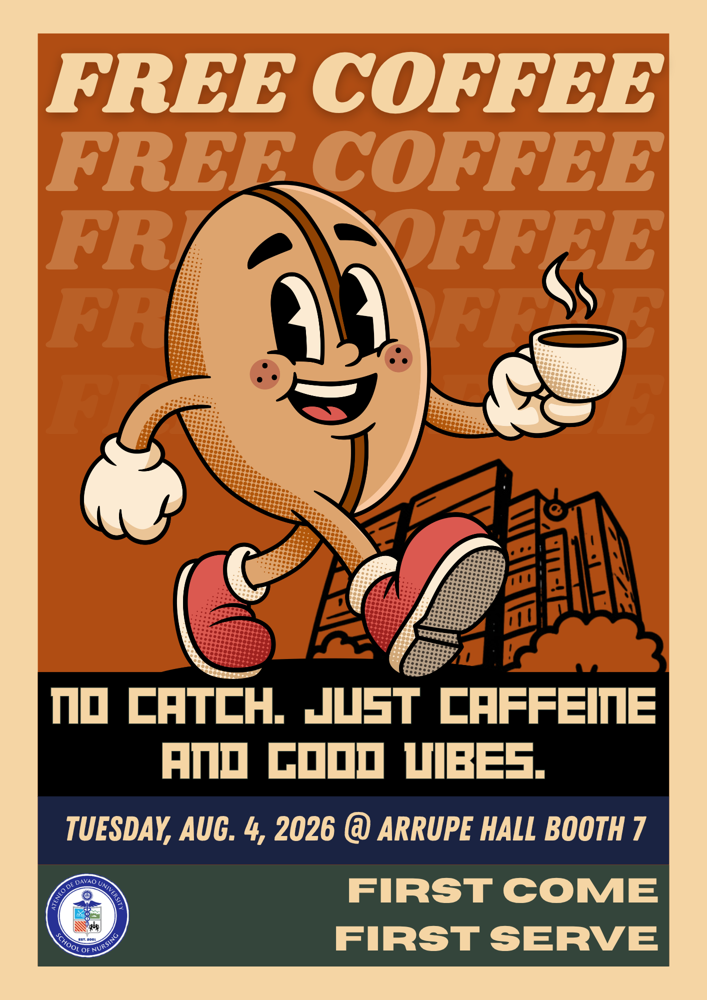

# Activity 1: Presentation Design Principles

> Discuss the design principles you applied and how they improved your presentation.

---

## What I Created

> I created a vintage, rubber-hose style promotional poster for a free coffee event hosted by the Ateneo de Davao University School of Nursing.

## Why I Came Up With the Concept

<!-- Leave blank -->

## How I Developed My Final Output

<!-- Leave blank -->

## Design Principles Applied

<!-- Leave blank -->

## How They Improved My Presentation

<!-- Leave blank -->
